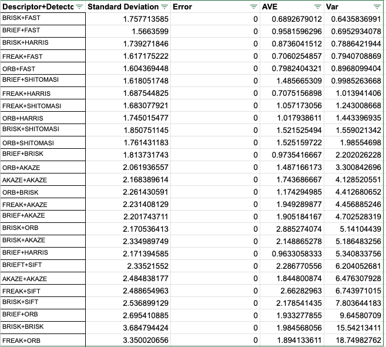
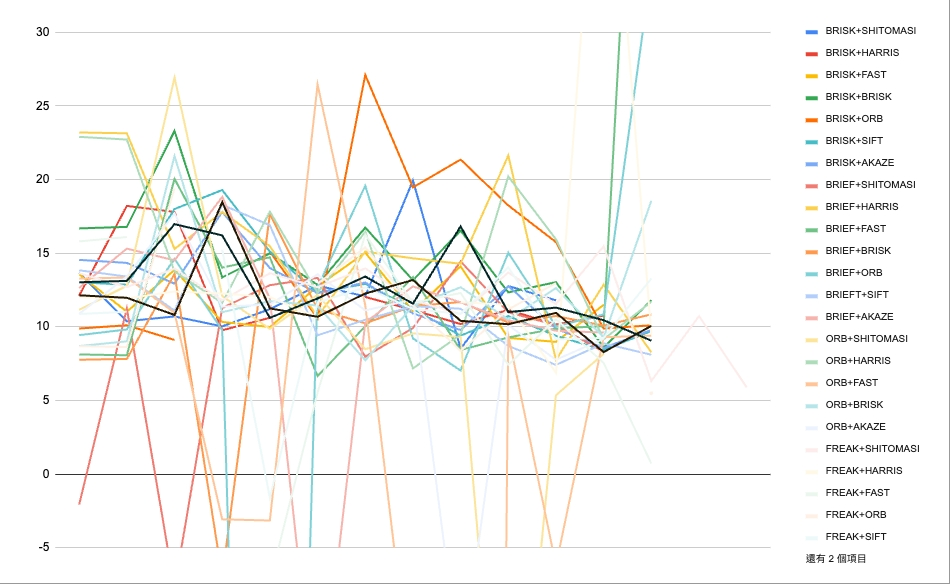

## FP.1 Match 3D Objects
the bounding Box (bbox) matching search bbox paris and compare the keypoints within each roi, and find the highest matched pairs
(camFusion_Student.cpp:274)

````cpp
void matchBoundingBoxes(std::vector<cv::DMatch> &matches,
                        std::map<int, int> &bbBestMatches, DataFrame &prevFrame,
                        DataFrame &currFrame) {
  // push best match bounding box from previous frame into current frame
  cv::Mat currImg = currFrame.cameraImg;
  cv::Mat prevImg = prevFrame.cameraImg;

  // bounding box no kpt and dmatch, only have lidar point
  for (auto it1 = currFrame.boundingBoxes.begin();
       it1 != currFrame.boundingBoxes.end(); ++it1) {

    int currBoxid = (*it1).boxID;
    std::vector<cv::DMatch> kptMatches = (*it1).kptMatches;
    int maxMatches = -1;
    int prevBoxid = -1;

    for (auto it2 = prevFrame.boundingBoxes.begin();
         it2 != prevFrame.boundingBoxes.end(); ++it2) {
      // looping from matches

      int numMatches = 0;
      for (auto kptMatches : matches) {

        // check if keypoint inside the bounding box
        cv::KeyPoint currKpt = currFrame.keypoints.at(kptMatches.trainIdx);
        if ((*it1).roi.contains(currKpt.pt)) {

          // also check if keypoint inside the another bounding box
          cv::KeyPoint prevKpt = prevFrame.keypoints.at(kptMatches.queryIdx);
          if ((*it2).roi.contains(prevKpt.pt)) {
            numMatches++;
          }
        }
      }
      if (numMatches > maxMatches) {
        maxMatches = numMatches;
        prevBoxid = (*it2).boxID;
      }
    }
    bbBestMatches[currBoxid] = prevBoxid;

    // looping for previous frame to find best match for current bounding
    // box
    // push best match bounding box from previous frame into current frame
  }
  // push the best match bounding box from previous with its box ID into
  // bbMatches
}
````

## FP.2 Compute Lidar-based TTC
The approach:
- sort the lidar points base on forward distance (x)
- find the mode of first 5% qunatile of elements base on the histogram distribution
- however the bins are continuous, so we comupte the mean of first 5% qunatile instead 

(camFusion_Student.cpp:239)

````cpp
void computeTTCLidar(std::vector<LidarPoint> &lidarPointsPrev,
                     std::vector<LidarPoint> &lidarPointsCurr, double frameRate,
                     double &TTC) {
  // TODO : Compute Time to Collision (TTC) based on Lidar point correspondences
  double dT = 1 / frameRate;
  double minXCurr = 0;
  double minXPrev = 0;
  double sampleQuntiles = 0.1;
  double unsampleQuantile = 0.01;
  int sampleSize = min(lidarPointsCurr.size(), lidarPointsPrev.size());
  int numInclude = (int)(sampleQuntiles * sampleSize);
  int numIgnore = (int)(unsampleQuantile * sampleSize);

  // sort lidar points with it distance to car in forward direction(X)
  std::sort(lidarPointsCurr.begin(), lidarPointsCurr.end(),
            [](LidarPoint a, LidarPoint b) { return a.x < b.x; });
  std::sort(lidarPointsPrev.begin(), lidarPointsPrev.end(),
            [](LidarPoint a, LidarPoint b) { return a.x < b.x; });
  double distDiffFrame = 0.0;
  for (int pt = 0; pt < sampleSize; ++pt) {
    distDiffFrame += -(lidarPointsCurr[pt].x - lidarPointsPrev[pt].x);
    if (pt < numIgnore) {
      continue;
    }
    if (pt < numInclude) {
      minXCurr += lidarPointsCurr.at(pt).x;
      minXPrev += lidarPointsPrev.at(pt).x;
    }
  }
  distDiffFrame = distDiffFrame / sampleSize;

  minXPrev /= numInclude - numIgnore;
  minXCurr /= numInclude - numIgnore;
  // compute velocity
  double vel = distDiffFrame / dT;
  // compute time-to-collision (TTC) based on velocity
  TTC = minXCurr / vel;
}
````

## FP.3 Associate Keypoint Correspondences with Bounding Boxes
- compute the meanMatchDistance
- filter out elements outside the threshold
- puts keypoints from matches into the bbox if it also lies in the bbox
- 
````cpp
void clusterKptMatchesWithROI(BoundingBox &boundingBox,
                              std::vector<cv::KeyPoint> &kptsPrev,
                              std::vector<cv::KeyPoint> &kptsCurr,
                              std::vector<cv::DMatch> &kptMatches) {

  // compute euclidian distance of matches
  double meanMatchDistance =
      std::accumulate(
          kptMatches.begin(), kptMatches.end(), 0.0,
          [](double m1, cv::DMatch m2) { return m1 + m2.distance; }) /
      kptMatches.size();

  double threshold = 0.8 * meanMatchDistance;

  // Find keypoints in the Bounding Box
  for (auto match : kptMatches) {
    if (match.queryIdx >= kptsPrev.size() ||
        match.trainIdx >= kptsCurr.size()) {
      break;
    }
    if (match.distance > threshold) {
      continue;
    }
    bool
        // inPrev = boundingBox.roi.contains(kptsPrev[match.queryIdx].pt),
        inCurr = boundingBox.roi.contains(kptsCurr[match.trainIdx].pt);
    if (inCurr) {
      boundingBox.kptMatches.push_back(match);
      boundingBox.keypoints.push_back(kptsCurr[match.trainIdx]);
    }
  }
}
````

## FP.4 Compute Camera-based TTC
- compute the TTC with keypoints distance ratios from delta frame
- 
````cpp
// Compute time-to-collision (TTC) based on keypoint correspondences in
// successive images
void computeTTCCamera(std::vector<cv::KeyPoint> &kptsPrev,
                      std::vector<cv::KeyPoint> &kptsCurr,
                      std::vector<cv::DMatch> kptMatches, double frameRate,
                      double &TTC, cv::Mat *visImg) {
  // compute distance ratios between all matched keypoints
  vector<double> distRatios; // stores the distance ratios for all keypoints
                             // between curr. and prev. frame

  //  Associate keypoint correspondences in successive images with
  // bounding Boxes
  for (auto it1 = kptMatches.begin(); it1 != kptMatches.end() - 1;
       ++it1) { // outer keypoint loop

    // get current keypoint and its matched partner in the prev. frame
    cv::KeyPoint kpOuterCurr = kptsCurr.at(it1->trainIdx);
    cv::KeyPoint kpOuterPrev = kptsPrev.at(it1->queryIdx);

    for (auto it2 = kptMatches.begin() + 1; it2 != kptMatches.end();
         ++it2) { // inner keypoint loop

      double minDist = 100.0; // min. required distance

      // get next keypoint and its matched partner in the prev. frame
      cv::KeyPoint kpInnerCurr = kptsCurr.at(it2->trainIdx);
      cv::KeyPoint kpInnerPrev = kptsPrev.at(it2->queryIdx);

      // compute distances and distance ratios
      double distCurr = cv::norm(kpOuterCurr.pt - kpInnerCurr.pt);
      double distPrev = cv::norm(kpOuterPrev.pt - kpInnerPrev.pt);

      if (distPrev > std::numeric_limits<double>::epsilon() &&
          distCurr >= minDist) { // avoid division by zero

        double distRatio = distCurr / distPrev;
        distRatios.push_back(distRatio);
      }
    } // eof inner loop over all matched kpts
  }   // eof outer loop over all matched kpts

  // only continue if list of distance ratios is not empty
  if (distRatios.size() == 0) {
    TTC = NAN;
    return;
  }

  //  Compute TTC based on keypoint correspondences in successive images
  // compute camera-based TTC from distance ratios
  double meanDistRatio =
      std::accumulate(distRatios.begin(), distRatios.end(), 0.0) /
      distRatios.size();

  double dT = 1 / frameRate;
  TTC = -dT / (1 - meanDistRatio);
}
````

## FP.5 Performance Evaluation 1
Because the TTC are base on the estimation of velocity, which are compute from the difference of lidar point from previous frame and current frame, it creates a problem when the estimation are inaccurate, such as when the lidar distance between car and sensors does not changed between previous frame and current frame. Thus, the estimation of velocity suddenly become extreme small, and the TTC become extremely long.

For example in this project, the velocity supposed to be consistant throughtout different frames which TTC lies on average of 13s, however there is a frame that the minX produce a insignificant difference from previous frame (0.01m), it creates an estimation of very small velocity (0.1m/s), therefore the TTC become inaccurate for such sceneraio.

## FP.6 Performance Evaluation 2
if we look at the comparison chart below, BRISK descriptor has the best accuracy, Combine with FAST and AKAZE, they produce a steady and confidence TTC,
however, other descriptor and detectors often encounter problems in keypoints matching, thus no keypoints match, and therefore no dist_ratio or dist_ratio small in compute_ttc_camera

The chart below also can see some of the combination of descriptor + detector produce a negative TTC, sometimes NAN value.

